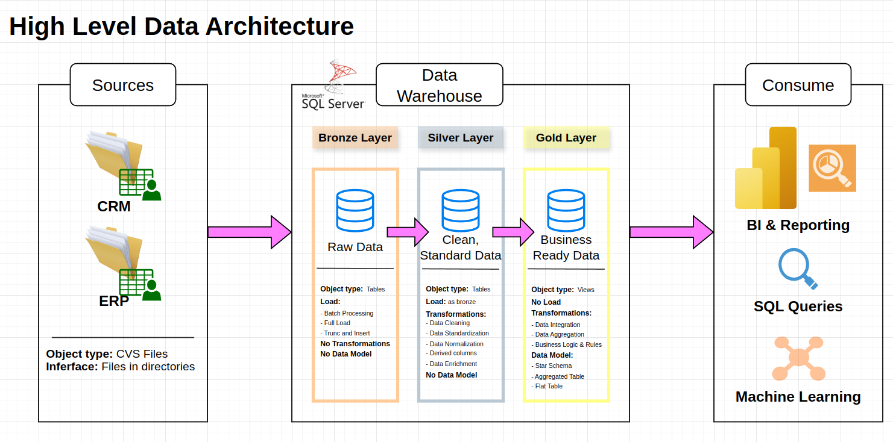

# SQL-DataWarehouse

Building a Data Warehouse with MS SQL Server, ETL batch processing and data modelling.

---

## Project Objective

Design and implement a scalable, maintainable SQL Server–based data warehouse that:

- **Centralizes data** from multiple source systems into a unified repository.
- **Implements a robust ETL batch process** to ingest, cleanse, and transform raw data.
- **Applies dimensional modelling** (star schema) for fast analytical queries.
- **Ensures data quality** through tests and validations.
- **Provides clear documentation** of architecture, data models, and operational procedures.

---

## Overview

This project demonstrates how to:

1. **Ingest** raw data files (CSV, JSON, etc.) into a staging area.
2. **Transform & load** data into dimension and fact tables following Kimball’s approach.
3. **ETL batching**
4. **Validate** loaded data using SQL tests.
5. **Document** the end-to-end pipeline and data models.

---

## 🏗️ Data Architecture

The data architecture for this project follows Medallion Architecture **Bronze**, **Silver**, and **Gold** layers:


1. **Bronze Layer**: Stores raw data as-is from the source systems. Data is ingested from CSV Files into SQL Server Database.
2. **Silver Layer**: This layer includes data cleansing, standardization, and normalization processes to prepare data for analysis.
3. **Gold Layer**: Houses business-ready data modeled into a star schema required for reporting and analytics.

---

## Repository Structure

```text
SQL-DataWarehouse/
├── datasets/        # Sample/raw data files 
├── docs/            # Architecture diagrams, data model ERDs, and design docs
├── scripts/         # T-SQL scripts for staging, dimensions, facts and ETL orchestration
├── tests/           # Data quality and integrity test scripts
├── .gitignore
├── LICENSE          # MIT License
└── README.md        # This
